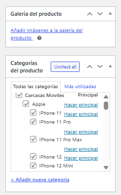
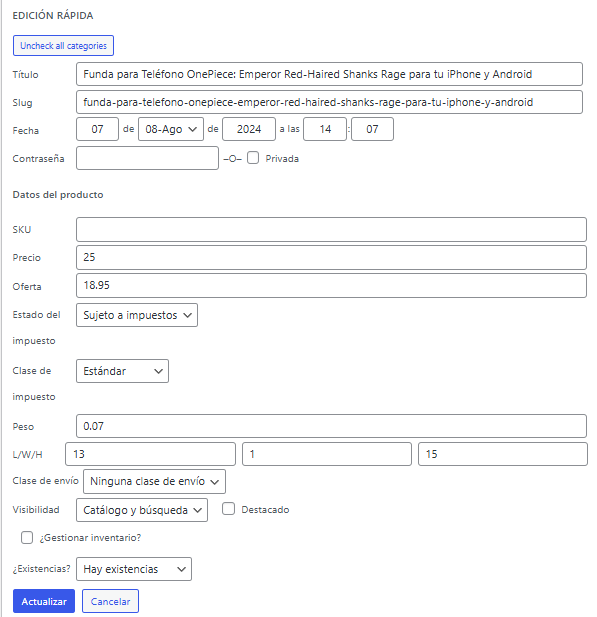
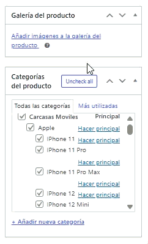

  

#Uncheck all product categories for WooCommerce

A small plugin, this one-click "Uncheck all" one will add a button on WooCommerce product category checklists. Works for Edit, Quick Edit, and Bulk Edit screens.

--- 
## 🖼️ Demo

## ✨ Features
- Adds "Uncheck All" to the Product Categories meta box on the product edit screen.

- Works on Quick Edit and Bulk Edit for multiple products.

- Lightweight: it will load only on WooCommerce product admin pages.
- No settings, no clutter; just one clean productivity booster.
Here’s a quick preview in action 👇

---

## 📦 Installation
1. Download the latest release ZIP from the [Releases page](../../releases).
2. In WordPress admin, go to Plugins → Add New → Upload Plugin.
3. Upload the ZIP and click Activate.
4. Go to any Product Edit Page, where the new "Uncheck all" button will be visible in the Product Categories box.

---

## 🧰 Requirements
- WordPress 5.8 or newer
- PHP 7.4 or newer
- WooCommerce (for product post type)

---

## 🐛 Issues and Feedback
Found any bugs or want to request features?  
Open an issue here: [GitHub Issues](../../issues)

---

## 🗺 Roadmap
- [ ] An optional "Uncheck all" for product tags.
- [ ] A toggle between "Check all" and "Uncheck all" modes.

---

## 🔖 Changelog
**1.0.0**—Initial public release  
Adds Uncheck all buttons to product edit, quick edit, and bulk edit.

---

## 📄 License
MIT © 2025 [Sherjan Mirza](https://github.com/sherjanmirza)